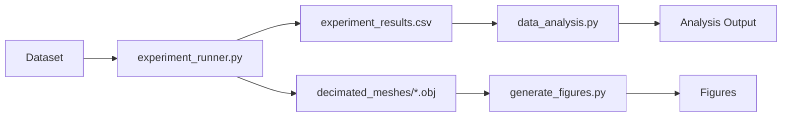
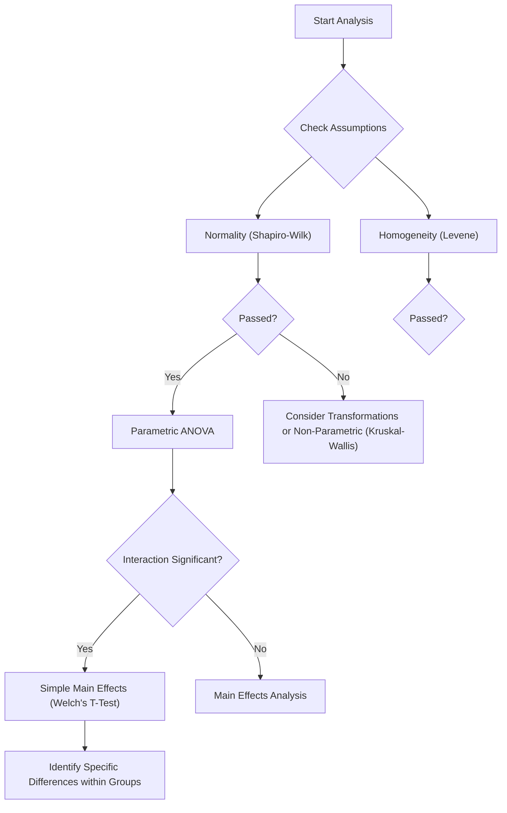

# Mesh Decimation Algorithms Comparison

This repository implements a comparative study of mesh decimation algorithms, specifically analyzing the trade-offs between **Quadric Error Metrics (QEM)**, **Vertex Clustering**, and a **Naive Edge Collapse** (QEM without optimal placement).

## 1. Repository Overview

The project is structured to run a controlled experiment, collect performance data, analyze it statistically, and visualize the results.

### Workflow

## 2. Algorithm Details

This section details the mathematical foundations of the algorithms used in this study.

### 2.1. Quadric Error Metrics (QEM)

**Quadric Error Metrics (QEM)** is a high-quality decimation algorithm that iteratively collapses edges $(v_1, v_2) \to \bar{v}$ to minimize geometric error. It preserves features by maintaining a "history" of the planes that met at each vertex.

#### Mathematical Formulation

1.  **Plane Representation**: Each face incident to a vertex $v$ defines a plane $p = [a, b, c, d]^T$ such that $ax + by + cz + d = 0$, or $p^T v = 0$.
2.  **Quadric Matrix**: The squared distance from a vertex $v$ to a plane $p$ is given by $D^2(v) = (p^T v)^2 = v^T (p p^T) v$. The error at a vertex is the sum of squared distances to all incident planes:
    $$ \Delta(v) = \sum*{p \in \text{planes}(v)} (p^T v)^2 = v^T \left( \sum*{p} p p^T \right) v = v^T Q v $$
    where $Q$ is a symmetric $4 \times 4$ matrix.
3.  **Edge Collapse Cost**: For an edge $(v_1, v_2)$, the new vertex $\bar{v}$ inherits the quadrics of both endpoints: $\bar{Q} = Q_1 + Q_2$. The cost of the collapse is the error at the new position:
    $$ \text{Cost}(\bar{v}) = \bar{v}^T \bar{Q} \bar{v} $$
4.  **Optimal Placement**: To minimize this cost, we solve for $\bar{v}$ where the gradient is zero ($\nabla \Delta(\bar{v}) = 0$). This results in a linear system:
    $$ \begin{bmatrix} q*{11} & q*{12} & q*{13} & q*{14} \\ q*{12} & q*{22} & q*{23} & q*{24} \\ q*{13} & q*{23} & q*{33} & q*{34} \\ 0 & 0 & 0 & 1 \end{bmatrix} \bar{v} = \begin{bmatrix} 0 \\ 0 \\ 0 \\ 1 \end{bmatrix} $$
    If the matrix is invertible, we find the optimal position. If not, we select the midpoint or one of the endpoints.

### 2.2. Vertex Clustering

**Vertex Clustering** is a fast, low-memory decimation technique suitable for out-of-core processing. It groups vertices based on spatial proximity rather than topology.

#### Algorithm Steps

1.  **Grid Discretization**: A bounding box is computed for the mesh and divided into a uniform 3D grid of cells with size $\epsilon$.
2.  **Vertex Mapping**: Each vertex $v = (x, y, z)$ is mapped to a cell index $(i, j, k)$:
    $$ i = \lfloor (x - x*{min}) / \epsilon \rfloor, \quad j = \lfloor (y - y*{min}) / \epsilon \rfloor, \quad k = \lfloor (z - z\_{min}) / \epsilon \rfloor $$
3.  **Representative Vertex**: All vertices within a single cell are collapsed into a single representative vertex $\bar{v}$. This can be:
    -   **Centroid**: Average of all vertex positions in the cell.
    -   **Median**: The vertex closest to the center.
    -   **Error-Minimizing**: The vertex that minimizes the maximum distance to all others in the cell.
4.  **Topology Update**:
    -   Faces with all 3 vertices in different cells are preserved (but deformed).
    -   Faces with 2 vertices in the same cell become edges (degenerate).
    -   Faces with all 3 vertices in the same cell become points (degenerate).
    -   Degenerate faces are removed.

**Trade-off**: While extremely fast ($O(N)$), Clustering is sensitive to grid alignment and can alter topology (e.g., merging separate objects if they are close).

## 3. Codebase Documentation

### `experiment_runner.py`

**Purpose**: The main engine of the experiment. It iterates through datasets, applies algorithms, and records metrics.

-   **Key Functions**:
    -   `apply_algorithm(ms, algo_name, target_faces)`: Applies the specific decimation filter.
        -   _QEM_: `meshing_decimation_quadric_edge_collapse` with `optimalplacement=True`.
        -   _Clustering_: `meshing_decimation_clustering`.
    -   `run_experiment()`: Main loop. Handles warm-up runs, timing (5 repetitions), and Hausdorff distance calculation.
-   **Metric Collection**:
    -   **Time**: Measured using `time.perf_counter_ns()` for high precision, averaged over 5 runs.
    -   **Hausdorff Distance**: Two-sided distance (`max(d(A,B), d(B,A))`) computed by reloading meshes into a clean `MeshSet` to ensure correct layer indexing.

### `data_analysis.py`

**Purpose**: Performs statistical analysis on `experiment_results.csv`.

-   **Libraries**: `pandas` (data manipulation), `scipy.stats` (normality/variance tests), `statsmodels` (ANOVA, Post-hoc).
-   **Key Steps**:
    1.  **Descriptive Statistics**: Calculates Mean, Standard Deviation (SD), and Standard Error of the Mean (SEM).
    2.  **Confidence Intervals**: Computes 95% CI using the t-distribution (`stats.t.interval`).
    3.  **Assumptions Testing**:
        -   _Shapiro-Wilk_: Tests for normality of residuals.
        -   _Levene's Test_: Tests for homogeneity of variance.
    4.  **ANOVA**: Two-Way ANOVA (`Time ~ Algorithm + Type`) to find main effects and interactions.
    5.  **Post-Hoc**: Independent T-tests (Welch's) to analyze simple main effects when interactions are significant.

### `generate_figures.py`

**Purpose**: Creates visual comparisons of the algorithms.

-   **Features**:
    -   **Rendering**: Uses Ambient Occlusion (AO) and smooth shading for a "rendered" look.
    -   **Wireframe**: Overlays a scaled (1.001x) wireframe to avoid Z-fighting artifacts.
    -   **Layout**: Generates a side-by-side comparison (Input vs. Algorithms) with embedded statistics.

---

## 3. Statistical Concepts & Knowledge Graph

This section breaks down the statistical methods used, what they mean, and how they connect.

### Concept Breakdown

#### 1. Descriptive Statistics

-   **Mean ($\bar{x}$)**: The average performance.
-   **Standard Deviation ($\sigma$)**: How much the data spreads around the mean. High SD = inconsistent performance.
-   **95% Confidence Interval (CI)**: A range where we are 95% sure the _true_ population mean lies.
    -   _Formula_: $\bar{x} \pm t \cdot \frac{s}{\sqrt{n}}$
    -   _Interpretation_: If CIs of two groups don't overlap, they are likely significantly different.

#### 2. ANOVA (Analysis of Variance)

-   **What it is**: A test to see if _any_ group mean is different from the others. It compares the variance _between_ groups to the variance _within_ groups.
-   **F-Statistic**: The ratio of Between-Group Variance to Within-Group Variance.
    -   _High F_: Groups are very different (Good).
    -   _Low F_: Groups are similar (Bad for proving difference).
-   **p-value**: The probability of seeing these results if all groups were actually the same.
    -   _p < 0.05_: Statistically significant difference exists.

### 3. Simple Main Effects (Independent T-Tests)

-   **What it is**: A follow-up analysis used when the ANOVA shows a significant _interaction_ between factors (e.g., Algorithm and Mesh Type).
-   **Why use it?**: A significant interaction means the effect of one factor depends on the level of the other. We break down the analysis to compare algorithms _within_ each mesh type separately.
-   **Welch's T-Test**: We use Welch's t-test because it does not assume equal variances (homogeneity of variance), which is safer given our data.

### Statistical Decision Tree

---

## 4. Verification Guide (Excel)

You can verify the Python results using Excel. Here is how to replicate the key statistics.

### A. Descriptive Statistics

Assume your data for **Algorithm A** is in cells `A2:A16`.

| Metric        | Excel Formula                                         | Explanation                              |
| :------------ | :---------------------------------------------------- | :--------------------------------------- |
| **Mean**      | `=AVERAGE(A2:A16)`                                    | Average value.                           |
| **Std Dev**   | `=STDEV.S(A2:A16)`                                    | Sample standard deviation.               |
| **Count (n)** | `=COUNT(A2:A16)`                                      | Number of samples.                       |
| **SEM**       | `=STDEV.S(A2:A16)/SQRT(COUNT(A2:A16))`                | Standard Error of Mean.                  |
| **95% CI**    | `=CONFIDENCE.T(0.05, STDEV.S(A2:A16), COUNT(A2:A16))` | Margin of error. Add/Subtract from Mean. |

### B. ANOVA (Manual Verification)

To verify the ANOVA F-statistic manually in Excel:

1.  **Calculate Group Means**: Calculate mean for each algorithm column.
2.  **Calculate Grand Mean**: Average of all data points.
3.  **SS_Between (Sum of Squares Between)**:
    -   Formula: $\sum n_i (\bar{x}_i - \bar{x}_{grand})^2$
    -   _Excel_: `=COUNT(A2:A16)*(AVERAGE(A2:A16)-GrandMean)^2 + ...` for each group.
4.  **SS_Within (Sum of Squares Within)**:
    -   Formula: $\sum (x_{ij} - \bar{x}_i)^2$
    -   _Excel_: `=DEVSQ(A2:A16) + DEVSQ(B2:B16) + ...`
5.  **MS (Mean Square)**:
    -   $MS_{between} = SS_{between} / (k - 1)$ (where k = number of groups)
    -   $MS_{within} = SS_{within} / (N - k)$ (where N = total samples)
6.  **F-Statistic**:
    -   $= MS_{between} / MS_{within}$
7.  **p-value**:
    -   `=F.DIST.RT(F_stat, df_between, df_within)`

### C. Independent T-Test (Welch's)

Since we are using Welch's T-test for simple main effects (due to the significant interaction), you can replicate this in Excel.

-   **Formula**: `=T.TEST(Range1, Range2, 2, 3)`
    -   `tails=2` (Two-tailed)
    -   `type=3` (Two-sample unequal variance / Heteroscedastic) - _This corresponds to Welch's t-test._

## 5. References & Resources

-   **ANOVA Explained**: [Khan Academy - ANOVA](https://www.khanacademy.org/math/statistics-probability/analysis-of-variance-anova-library)
-   **Welch's T-test**: [Wikipedia - Welch's t-test](https://en.wikipedia.org/wiki/Welch%27s_t-test)
-   **Hausdorff Distance**: [Wikipedia - Hausdorff Distance](https://en.wikipedia.org/wiki/Hausdorff_distance)
-   **Python Statsmodels**: [Statsmodels Documentation](https://www.statsmodels.org/stable/index.html)
