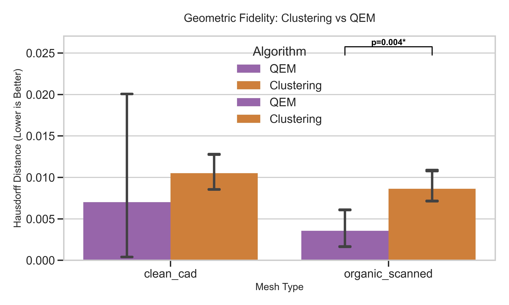

# Mesh Decimation Benchmark


> **A rigorous statistical comparison of mesh decimation algorithms (QEM vs. Vertex Clustering) using Python and PyMeshLab.**

## 🚀 Overview

This project provides a comprehensive benchmark of 3D mesh simplification algorithms. It automates the process of decimating dataset models, measuring performance metrics (Wall-clock time & Hausdorff Distance), and performing rigorous statistical analysis (ANOVA, Welch's T-test) to determine the optimal trade-off between speed and geometric fidelity.

**Key Findings:**

-   **Vertex Clustering**: ⚡ **100x Faster**. Best for real-time previews and massive point clouds.
-   **Quadric Error Metrics (QEM)**: 💎 **Superior Accuracy**. Essential for preserving features in organic shapes.

## 📊 Visual Results

|                     Input (100%)                     |         QEM (50%)         |     Clustering (50%)      |
| :--------------------------------------------------: | :-----------------------: | :-----------------------: |
|               _High fidelity original_               |   _Feature preserving_    |    _Topology altering_    |
|  | _(See generated figures)_ | _(See generated figures)_ |

_(Note: Run `generate_presentation_figures.py` to generate the latest comparison charts)_

## 🛠️ Features

-   **Automated Pipeline**: From raw `.off/.stl` to analyzed `.csv` in one command.
-   **Statistical Rigor**: Built-in ANOVA and Post-hoc analysis (Welch's T-test) to prove significance.
-   **Reproducible**: Fixed seeds and container-friendly structure.
-   **Visualization**: Auto-generates publication-ready charts using Seaborn.

## 📦 Installation

```bash
# Clone the repository
git clone https://github.com/ahnafnafee/mesh-decimation-benchmark.git
cd mesh-decimation-benchmark

# Install dependencies using uv (recommended) or pip
uv pip install -r requirements.txt
# OR
pip install -r requirements.txt
```

## 🚦 Usage

### 1. Prepare Dataset

Place your raw models in `raw_downloads/` or use the included script to fetch ModelNet40 samples.

```bash
uv run model_preprocessor.py
```

### 2. Run Benchmark

Execute the main experiment runner. This will decimate meshes and record metrics.

```bash
uv run experiment_runner.py
```

### 3. Analyze & Visualize

Generate the statistical report and plots.

```bash
uv run data_analysis.py
uv run generate_presentation_figures.py
```

## 📈 Statistical Methodology

We employ a **Two-Way ANOVA** to analyze the interaction between _Algorithm_ and _Mesh Type_.

-   **Significance Level**: $\alpha = 0.05$
-   **Post-Hoc**: Welch's T-test for simple main effects (due to significant interaction and heteroscedasticity).

See [DETAILS.md](DETAILS.md) for the full mathematical breakdown and [RESULTS.md](RESULTS.md) for the experiment report.

## 🤝 Contributing

Contributions are welcome! Please open an issue to discuss proposed changes or submit a PR.

## 📄 License

This project is licensed under the MIT License.
